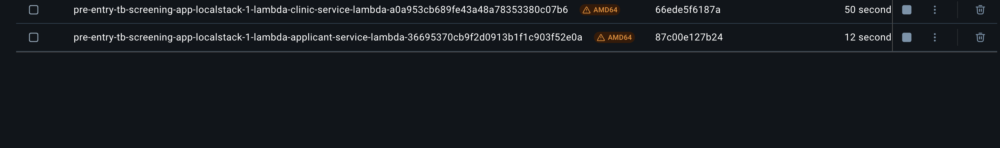
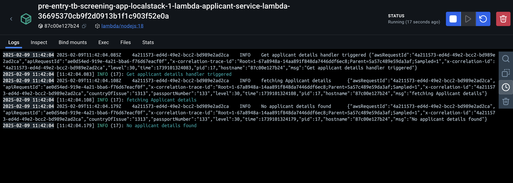

# PETS (Pre-Entry TB Screening)

## Overview

An electronic data capture system designed to address inconsistencies and fraud issues in the current [Tuberculosis](https://confluence.collab.test-and-trace.nhs.uk/pages/viewpage.action?pageId=357697034) screening process. For a deepdive into the process, check out the [UK Tuberculosis Technical Instructions](https://assets.publishing.service.gov.uk/media/5cd18ae5e5274a34ee7f0275/UK_tuberculosis_technical_instructions_version_7.pdf).

### Built With

[![Typescript][typescript.org]][Typescript-url]

[![React][react.js]][React-url]

[![Vite][vite.dev]][Vite-url]

[![AWS][aws.com]][AWS-url]

[![LocalStack][localstack.cloud]][Localstack-url]

[![MiddyJS][middy.js]][Middy-url]

[![Cypress][cypress.com]][Cypress-url]

### Architecture

This is currently available on [confluence](https://confluence.collab.test-and-trace.nhs.uk/display/TPT/High+Level+Technical+Architecture).

### Monorepo Organization

```tree
📦pets-ui      # Frontend UI Root
 ┣ 📂cypress   # End to End Tests
 ┣ 📂src       # Source Code
 ┣ 📂test      # Integration Tests

 📦pets-core-services             # Core Services for the Backend
 ┣ 📂applicant-service            # Everything pertaining to Applicant
    ┣ 📂lambdas                   # Lambda code for Applicant service lambda
 ┣ 📂application-service          # Everything Application-related
    ┣ 📂lambdas                   # Lambda code for Application service lambda
 ┣ 📂clinic-service               # Everything Clinic-related
    ┣ 📂lambdas                   # Lambda code for Clinic service lambda
 ┣ 📂lambda-authoriser            # Authentication Service
    ┣ 📂lambdas                   # Lambda code for Authoriser lambda


 📦pets-local-infra             # Definition of lambdas, dynamodb, apigateway etc needed to emulate AWS services for local development
 ┣ 📜lib/local-infra-stack.ts   # Local aws services definition

 📦Config                     # Project Configs
 ┣ 📜.env                     # configs for local environment
 ┣ 📜.env.local.secrets       # environment secrets for local environment, generated when you run `pnpm pull:secrets`. Please don't commit 🙅🏽!
 ┣ 📜.env.dev                 # configs for a Dev deployment
 ┣ 📜.env.test                # configs for a Test deployment
 ┣ 📜.env.test.local          # configs for unit and integration tests
```

Additional configs specific to a core service are defined in their directory

## Getting Started

### Supported Platforms

- Mac
- Linux
- Windows 10 or Windows 11(64-bits)

### Prerequisites

- Node 18

  - `volta` installation [guide](https://docs.volta.sh/guide/getting-started)

  - Install Node 18

    ```sh
    volta install node@18
    ```

  - Verify Node Version with `node -v`, should return `v18.20.6`

- Pnpm

   ```sh
   npm install -g pnpm@9.15.4
   ```

- Docker

  - Check if Docker is installed.

   ```sh
      docker -v
   ```

   If Docker is installed, this command will return the installed Docker Engine version. If it is already installed, you can skip the next steps.

  - Install Docker via Docker Desktop using the installation [guide](https://docs.docker.com/engine/install/). Please note this is blocked on Accenture laptops.

  - Alternatively, install Rancher Desktop.
    - Download from [homepage](https://rancherdesktop.io/) and install.
    - Verify docker installation

      ```sh
         docker -v
      ```

    - Make any necessary [configuration](https://docs.localstack.cloud/user-guide/integrations/rancher-desktop/) changes for localstack.

- Git Secrets
  - Install
    - Linux: `apt-get install git-secrets`
    - Mac: `brew install git-secrets`
    - Windows:
      1.  Ensure git is configured in your windows OS
      2.  Clone awslabs/git-secrets repo by executing `git clone https://github.com/awslabs/git-secrets.git` in Git Bash
      3.  Open Powershell and 'run as administrator' and go to the path where the repo is cloned - e.g. `C:\user\...\ttn\git-secrets`
      4.  Execute the installation script by executing `./install.ps1`
      5.  Now that you have git secrets in your windows OS, go cd to the project repo and execute `git secrets --install` to add a git secrets hook to the local repository

### Installation

1. Clone the repo

   ```sh
   git clone git@github.com:UKHSA-Internal/pre-entry-tb-screening-app.git
   cd pre-entry-tb-screening-app
   ```

2. Install project dependencies

   ```sh
   pnpm i
   ```

   This would pull Node dependencies for frontend and core services.

3. Install recommended VsCode extensions present in `.vscode/extensions.json`
   

   This would install recommended extensions for linting and formatting.

4. Configure Git Secrets

   ```sh
     git secrets --install
     git secrets --register-aws
   ```

5. Configure End of Line

   - Open the User Settings from the Command Palette and search for "end of line"

   - Ensure "Prettier: End Of Line" is set to "lf"

   - Ensure "Files: Eol" is set to "\n"

   - Run the following:

   ```sh
      git config --global core.autocrlf input
   ```

### Pulling Secrets for local development

Skip this section if you are not running E2E tests on your machine. As a prerequisite, please ensure you have administrator access to the **pre-entry-tb-screening-nl-develop** account.

1. Navigate to [Halo page](https://halopr.awsapps.com/start/#/?tab=accounts).

2. Select Administrator Access Keys for **pre-entry-tb-screening-nl-develop** account.

3. Copy the commands under option to Set AWS environment Variables. Be sure to check the OS tab is set correctly beforehand.


4. Open a new shell and run the commands.

5. Pull the secrets with the commands below:

   ```sh
   pnpm pull:secrets
   ```

6. Verify `.env.local.secrets` has been created in `configs` directory. Double check this file is not committed.

## Development Processes

All captured [here](https://confluence.collab.test-and-trace.nhs.uk/pages/viewpage.action?pageId=374193469)

### Ticket Creation

User story and bug tickets should follow this [template](https://ukhsa.atlassian.net/browse/TBBETA-405).

### Picking up Tickets

- When starting work on a new ticket, open a new branch using the following naming convention: `feature/{ticket-number}-{concise-description}`.
   For example: `feature/TBBETA-123-setup-auth`.

- Commits should be done regularly and commit messages should be meaningful. Commit messages should follow this convention - `{ticket-number}: {commit_message}`.
   For example: `TBBETA-123: Added unit tests`

- Ensure your commit email is your ukhsa email. Check this SO [thread](https://stackoverflow.com/a/51682403) on how to change that.

## Running Development Environment

1. Start up development environment

   ```sh
   pnpm start
   ```

   Please ensure Docker is running before you run this command.
   Please note this would take a bit of time(roughly 45 seconds)

2. Navigate to the React app on <http://localhost:3000/>

See individual folder READMEs for more information

Alternatively, for slow PCs, you can start only the UI without the backend with this command `pnpm start:ui`.

### Debugging Core Services Locally

For core services, we rely on localstack for emulating AWS services. For debugging Lambda functions, you can access detailed logs directly from the docker container where the Lambda is running. This can be done using:

- Docker Desktop




## Testing

To run all unit and integration tests for all [packages](#monorepo-organization):

```sh
pnpm -r test
```

Under the hood, the command runs `pnpm test` in each packages. Alternatively to run unit tests for a single package, you can `cd` into its directory and run `pnpm test`.

To run end to end tests, please visit the pets UI [Cypress Section](./pets-ui/README.md#cypress-end-to-end-tests)

By default, backend logs are hidden in tests as they could get noisy. To view your backend log messages and errors in tests, add the line below to `configs/.env.test.local`:

```sh
LOG_LEVEL=info
```

Don't forget to remove afterwards🫣

### Preloaded Test Data(Might be broken due to Authentication)

- Passport Number: ABC1234JANE
- Country of Issue: Barbados

Kindly check `pets-core-services/src/applicant-service/fixtures/applicants.ts` for more information on this applicant.

## Deployment

- Before proceeding, ensure you have access to the AWS environment. Kindly check this [guide](https://confluence.collab.test-and-trace.nhs.uk/display/TPT/Request+Access+to+AWS+Environments?src=contextnavpagetreemode) on raising the request.

- Navigate to the [actions](https://github.com/UKHSA-Internal/pre-entry-tb-screening-app/actions) page.

- At the side panel, Find on the workflow with name `Pets Deployment - {target-env}` and click on it.
- At top right corner, find the `Run Workflow` Button.
- Start the deployment workflow by clicking on the button and providing your branch name. Please note that this would overwrite any existing deployment at the target environment.
- If a PR is already raised for your branch, after successful deployment, you should receive an email with the deployment url

## Automated dependency updates

### Renovate

- The `renovate.yaml` workflow will run once at Midnight on weekdays.

- PRs for dependencies requiring security updates will be opened by the workflow.

## Culture

**_As Engineers, we commit to…_**

- Create a learning-focused working environment.
- No finger pointing, the code is everyone’s responsibility, and we are all accountable for changes.
- Ensure that all code is well-tested.
- Encourage contribution from everyone.
- Keep it simple and straighforward.

[typescript.org]: https://img.shields.io/badge/typescript-20232A?style=for-the-badge&logo=typescript
[Typescript-url]: https://frontendmasters.com/courses/typescript-v4/
[React.js]: https://img.shields.io/badge/React-20232A?style=for-the-badge&logo=react&logoColor=61DAFB
[React-url]: https://reactjs.org/
[Vite.dev]: https://img.shields.io/badge/vite-20232A?style=for-the-badge&logo=vite
[Vite-url]: https://v2.vitejs.dev/
[aws.com]: https://img.shields.io/badge/Aws-20232A?style=for-the-badge&logo=amazon
[AWS-url]: https://aws.amazon.com/getting-started/
[localstack.cloud]: https://img.shields.io/badge/localstack-20232A?style=for-the-badge&logo=localstack
[Localstack-url]: https://www.localstack.cloud/
[middy.js]: https://img.shields.io/badge/middyJs-20232A?style=for-the-badge
[Middy-url]: https://middy.js.org/
[cypress.com]: https://img.shields.io/badge/Cypress-20232A?style=for-the-badge&logo=cypress
[Cypress-url]: https://docs.cypress.io/app/get-started/why-cypress

