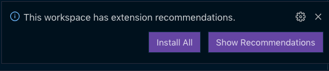

# PETS (Pre-Entry TB Screening)

## Overview

An electronic data capture system designed to address inconsistencies and fraud issues in the current [Tuberculosis](https://confluence.collab.test-and-trace.nhs.uk/pages/viewpage.action?pageId=357697034) screening process. For a deepdive into the process, check out the [UK Tuberculosis Technical Instructions](https://assets.publishing.service.gov.uk/media/5cd18ae5e5274a34ee7f0275/UK_tuberculosis_technical_instructions_version_7.pdf).

### Built With

[![Typescript][typescript.org]][Typescript-url]

[![React][react.js]][React-url]

[![Vite][vite.dev]][Vite-url]

[![AWS][aws.com]][AWS-url]

[![Serverless][serverless.com]][Serverless-url]

[![Cypress][cypress.com]][Cypress-url]

### Architecture

This is currently available on [confluence](https://confluence.collab.test-and-trace.nhs.uk/display/TPT/High+Level+Technical+Architecture).

### Monorepo Organization

```tree
📦pets-ui      # Frontend UI Root
 ┣ 📂cypress   # End to End Tests
 ┣ 📂src       # Source Code
 ┣ 📂test      # Integration Tests

 📦pets-core-services             # Core Services for the Backend
 ┣ 📂applicant-service            # Everything pertaining to Applicant
    ┣ 📂lambdas                   # Lambda code for Applicant service lambda
 ┣ 📂application-service          # Everything Application-related
    ┣ 📂lambdas                   # Lambda code for Application service lambda
 ┣ 📂clinic-service               # Everything Clinic-related
    ┣ 📂lambdas                   # Lambda code for Clinic service lambda
 ┣ 📂lambda-authoriser            # Authentication Service
    ┣ 📂lambdas                   # Lambda code for Authoriser lambda


 📦pets-local-infra             # Definition of lambdas, dynamodb, apigateway etc needed to emulate AWS services for local development
 ┣ 📜lib/local-infra-stack.ts   # Local aws services definition

 📦Config                     # Project Configs
 ┣ 📜.env                     # configs for local environment
 ┣ 📜.env.dev                 # configs for a Dev deployment
 ┣ 📜.env.test                # configs for a Test deployment
 ┣ 📜.env.test.local          # configs for unit and integration tests
```

Additional configs specific to a core service are defined in their directory

## Getting Started

### Supported Platforms

- Mac
- Linux
- Windows 10 or Windows 11(64-bits)

### Prerequisites

- Node 18

  - `volta` installation [guide](https://docs.volta.sh/guide/getting-started)

  - Install Node 18

    ```sh
    volta install node@18
    ```

  - Verify Node Version with `node -v`, should return `v18.20.6`

- Pnpm

```sh
npm install -g pnpm@9.15.4
```

- Docker
  - Docker installation [guide](https://docs.docker.com/engine/install/)

```sh
npm install -g pnpm@9.15.4
```

- Git Secrets
  - Install
    - Linux: `apt-get install git-secrets`
    - Mac:  `brew install git-secrets`
    - Windows: `git secrets --install -f` # Use git terminal

### Installation

1. Clone the repo

   ```sh
   git clone git@github.com:UKHSA-Internal/pre-entry-tb-screening-app.git
   cd pre-entry-tb-screening-app
   ```

2. Install project dependencies

   ```sh
   pnpm i
   ```

   This would pull Node dependencies for frontend and core services.

3. Install recommended VsCode extensions present in `.vscode/extensions.json`
  

   This would install recommended extensions for linting and formatting.

4. Configure Git Secrets

    ```sh
      git secrets --install
      git secrets --register-aws
    ```

### Running Development Environment

1. Start up development environment

   ```sh
   pnpm start
   ```

    Please ensure Docker is running before you run this command.
    Please note this would take a bit of time(roughly 45 seconds)

2. Navigate to the React app on <http://localhost:3000/>

See individual folder READMEs for more information

### Testing

To run all unit and integration tests for all [packages](#monorepo-organization):

```sh
pnpm -r test
```

Under the hood, the command runs `pnpm test` in each packages. Alternatively to run unit tests for a single package, you can `cd` into its directory and run `pnpm test`.

To run end to end tests, please visit the pets UI [command section](./pets-ui/README.md#commands)

### Deployment

- Before proceeding, ensure you have access to the AWS environment. Kindly check this [guide](https://confluence.collab.test-and-trace.nhs.uk/display/TPT/Request+Access+to+AWS+Environments?src=contextnavpagetreemode) on raising the request.

- Navigate to the [actions](https://github.com/UKHSA-Internal/pre-entry-tb-screening-app/actions) page.

#### UI

To deploy the UI to a target environment {target-env}:

- At the side panel, Find on the workflow with name `Pets UI Deployment - {target-env}` and click on it.
- At top right corner, find the `Run Workflow` Button.
- Start the deployment workflow by clicking on the button and providing your branch name. Please note that this would overwrite any existing deployment at the target environment.
- If a PR is already raised for your branch, after successful deployment, you should receive an email with the deployment url

#### Core Services

Before you proceed with the core services deployment, please note that this would deploy only services with changes.

To deploy the Core services to a target environment {target-env}:

- At the side panel, Find on the workflow with name `Pets Core Services Deployment - {target-env}` and click on it.
- At top right corner, find the `Run Workflow` Button.
- Start the deployment workflow by clicking on the button and providing your branch name. Please note that this would overwrite any existing deployment at the target environment.

## Automated dependency updates

### Renovate

- The `renovate.yaml` workflow will run once at Midnight on weekdays.

- PRs for dependencies requiring security updates will be opened by the workflow.

## Culture

***As Engineers, we commit to…***

- Create a learning-focused working environment.
- No finger pointing, the code is everyone’s responsibility, and we are all accountable for changes.
- Ensure that all code is well-tested.
- Encourage contribution from everyone.
- Keep it simple and straighforward.

[typescript.org]: https://img.shields.io/badge/typescript-20232A?style=for-the-badge&logo=typescript
[Typescript-url]: https://frontendmasters.com/courses/typescript-v4/
[React.js]: https://img.shields.io/badge/React-20232A?style=for-the-badge&logo=react&logoColor=61DAFB
[React-url]: https://reactjs.org/
[Vite.dev]: https://img.shields.io/badge/vite-20232A?style=for-the-badge&logo=vite
[Vite-url]: https://v2.vitejs.dev/
[aws.com]: https://img.shields.io/badge/Aws-20232A?style=for-the-badge&logo=amazon
[AWS-url]: https://aws.amazon.com/getting-started/
[serverless.com]: https://img.shields.io/badge/serverless-20232A?style=for-the-badge&logo=serverless
[Serverless-url]: https://www.serverless.com/
[cypress.com]: https://img.shields.io/badge/Cypress-20232A?style=for-the-badge&logo=cypress
[Cypress-url]: https://docs.cypress.io/app/get-started/why-cypress
